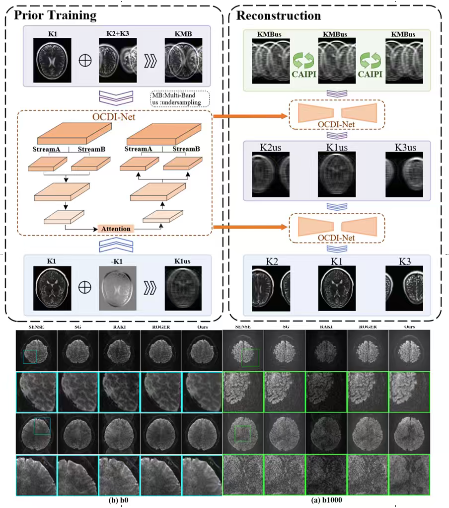

# Paper Title: 

Back to Physics: Operator-Guided Generative Paths for SMS MRI Reconstruction

## Author(s)

Zhibo Chen, Yu Guan, Yajuan Huang, Chaoqi Chen, XiangJi, QiuyunFan, Dong Liang, Senior Member, IEEE, Qiegen Liu, Senior Member, IEEE

## Publication Information

https://arxiv.org/abs/2602.07820
---

## Paper Structure and Experimental Results

The figure below illustrates the overall framework of the paper and key experimental results:

## Other Related Projects

  * Multi-Channel and Multi-Model-Based Autoencoding Prior for Grayscale Image Restoration  
    [**[Paper]**](https://ieeexplore.ieee.org/stamp/stamp.jsp?tp=&arnumber=8782831)  [**[Code]**](https://github.com/yqx7150/MEDAEP)   [**[Slide]**](https://github.com/yqx7150/EDAEPRec/tree/master/Slide)  [**[数学图像联盟会议交流PPT]**](https://github.com/yqx7150/EDAEPRec/tree/master/Slide)

  * Highly Undersampled Magnetic Resonance Imaging Reconstruction using Autoencoding Priors  
    [**[Paper]**](https://cardiacmr.hms.harvard.edu/files/cardiacmr/files/liu2019.pdf)  [**[Code]**](https://github.com/yqx7150/EDAEPRec)   [**[Slide]**](https://github.com/yqx7150/EDAEPRec/tree/master/Slide) [**[数学图像联盟会议交流PPT]**](https://github.com/yqx7150/EDAEPRec/tree/master/Slide)

  * High-dimensional Embedding Network Derived Prior for Compressive Sensing MRI Reconstruction  
    [**[Paper]**](https://www.sciencedirect.com/science/article/abs/pii/S1361841520300815?via%3Dihub)   [**[Code]**](https://github.com/yqx7150/EDMSPRec)

  * Denoising Auto-encoding Priors in Undecimated Wavelet Domain for MR Image Reconstruction  
    [**[Paper]**](https://www.sciencedirect.com/science/article/pii/S0925231221000990) [**[Paper]**](https://arxiv.org/ftp/arxiv/papers/1909/1909.01108.pdf)  [**[Code]**](https://github.com/yqx7150/WDAEPRec)

  * Complex-valued MRI data from SIAT--test31 [**[Data]**](https://github.com/yqx7150/EDAEPRec/tree/master/test_data_31)
  * More explanations with regard to the MoDL test datasets, we use some data from the test dataset in "dataset.hdf5" file, where the image slice numbers are 40,48,56,64,72,80,88,96,104,112(https://drive.google.com/file/d/1qp-l9kJbRfQU1W5wCjOQZi7I3T6jwA37/view)
  * DDP Method Link [**[DDP Code]**](https://github.com/kctezcan/ddp_recon)
  * MoDL Method Link [**[MoDL code]**](https://github.com/hkaggarwal/modl)
  * Complex-valued MRI data from SIAT--SIAT_MRIdata200 [**[Data]**](https://github.com/yqx7150/SIAT_MRIdata200)  
  * Complex-valued MRI data from SIAT--SIAT_MRIdata500-singlecoil [**[Data]**](https://github.com/yqx7150/SIAT500data-singlecoil)   
  * Complex-valued MRI data from SIAT--SIAT_MRIdata500-12coils [**[Data]**](https://github.com/yqx7150/SIAT500data-12coils)    

  * Learning Multi-Denoising Autoencoding Priors for Image Super-Resolution  
    [**[Paper]**](https://www.sciencedirect.com/science/article/pii/S1047320318302700)   [**[Code]**](https://github.com/yqx7150/MDAEP-SR)

  * REDAEP: Robust and Enhanced Denoising Autoencoding Prior for Sparse-View CT Reconstruction  
    [**[Paper]**](https://ieeexplore.ieee.org/document/9076295)   [**[Code]**](https://github.com/yqx7150/REDAEP)   [**[PPT]**](https://github.com/yqx7150/HGGDP/tree/master/Slide)  [**[数学图像联盟会议交流PPT]**](https://github.com/yqx7150/EDAEPRec/tree/master/Slide)

  * Universal Generative Modeling for Calibration-free Parallel MR Imaging  
    [**[Paper]**](https://biomedicalimaging.org/2022/)   [**[Code]**](https://github.com/yqx7150/UGM-PI)   [**[Poster]**](https://github.com/yqx7150/UGM-PI/blob/main/paper%20%23160-Poster.pdf)

* Progressive Colorization via Interative Generative Models  
  [**[Paper]**](https://ieeexplore.ieee.org/document/9258392)   [**[Code]**](https://github.com/yqx7150/iGM)   [**[PPT]**](https://github.com/yqx7150/HGGDP/tree/master/Slide)  [**[数学图像联盟会议交流PPT]**](https://github.com/yqx7150/EDAEPRec/tree/master/Slide)

* Joint Intensity-Gradient Guided Generative Modeling for Colorization
  [**[Paper]**](https://arxiv.org/abs/2012.14130)   [**[Code]**](https://github.com/yqx7150/JGM)   [**[PPT]**](https://github.com/yqx7150/HGGDP/tree/master/Slide)  [**[数学图像联盟会议交流PPT]**](https://github.com/yqx7150/EDAEPRec/tree/master/Slide)

 * One-shot Generative Prior in Hankel-k-space for Parallel Imaging Reconstruction  
   [**[Paper]**](https://ieeexplore.ieee.org/document/10158730)   [**[Code]**](https://github.com/yqx7150/HKGM)   [**[PPT]**](https://github.com/yqx7150/HKGM/tree/main/PPT)

